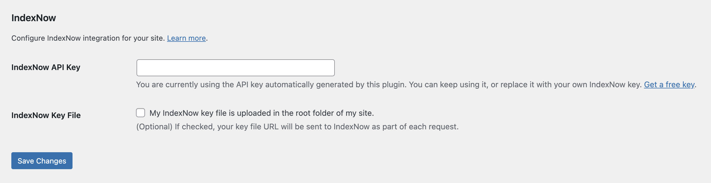

# Lightweight Integration for IndexNow

A small WordPress plugin that submits content URLs to [IndexNow](https://www.indexnow.org/) when posts, pages, and WooCommerce products are published, updated, or moved to the trash.

It adds two settings under **Settings → General**, with no JavaScript, CSS, or front-end output. This is an independent plugin by Nicola Mustone, not affiliated with or endorsed by IndexNow or its participating search engines.

## Requirements

- WordPress 6.0 or newer (tested up to 6.9).
- PHP 7.4 or newer.
- WooCommerce only if you want to submit product URLs.

## Installation

Upload the `lightweight-integration-for-indexnow` folder to `wp-content/plugins/`, or install a built plugin ZIP through **Plugins → Add New Plugin → Upload Plugin**. Activate **Lightweight Integration for IndexNow** in WordPress.

For local development, clone this repository into your WordPress plugins directory:

```sh
cd /path/to/wordpress/wp-content/plugins
git clone https://github.com/SirDarcanos/lightweight-integration-for-indexnow.git
```

There are no Composer or npm dependencies to install.

## Settings

Activation generates a 32-character API key. Open **Settings → General → IndexNow** to configure:

| Setting | Purpose |
| --- | --- |
| **IndexNow API Key** | Keep the generated key or replace it with your own. An empty key disables submissions. |
| **IndexNow Key File** | Include `https://example.com/YOUR_KEY.txt` as `keyLocation` in each request. |

> [!IMPORTANT]
> The plugin generates the key, not the key file. Upload a file named `YOUR_KEY.txt`, containing only your API key, to your site's root before enabling the key-file checkbox. The settings screen checks whether that file exists and is readable under the WordPress root (`ABSPATH`).



## Submitted URLs

Each submission includes the content's permalink and any related taxonomy archive URLs:

| Content type | Taxonomy archives |
| --- | --- |
| Posts | Categories and tags |
| Pages | None by default |
| WooCommerce products | Product categories and product tags |

Duplicate and empty URLs are removed before submission. Saves of drafts, revisions, and autosaves are skipped. Localhost detection skips submissions when the site hostname matches `localhost`, `127.0.0.1`, or `::1`.

Requests go to `https://api.indexnow.org/indexnow` through the WordPress HTTP API and are non-blocking by default. A dispatched request is not confirmation that a search engine accepted or indexed the URLs. Errors returned to the plugin during an admin request are stored for a one-time administrator notice.

## Developer hooks

Add customizations in a site-specific plugin or your theme. For example, include a published custom post type:

```php
add_filter( 'nm_indexnow_supported_post_types', function ( $post_types ) {
    $post_types[] = 'book';
    return $post_types;
} );
```

| Filter | Controls |
| --- | --- |
| `nm_indexnow_should_ping_on_save` | Whether a save triggers a submission. |
| `nm_indexnow_should_ping_on_trashed` | Whether moving content to the trash triggers a submission. |
| `nm_indexnow_supported_post_types` | Tracked post types; defaults to `post`, `page`, and `product`. |
| `nm_indexnow_taxonomy_map` | Taxonomies whose archive URLs are collected for each post type. |
| `nm_indexnow_collect_urls` | The collected URL list. |
| `nm_indexnow_key_location_url` | The key-file URL. |
| `nm_indexnow_endpoint` | The submission endpoint. |
| `nm_indexnow_request_args` | WordPress HTTP request arguments. |

Actions are available before submission (`nm_indexnow_before_submit`), after the request returns without a detected error (`nm_indexnow_after_submit`), and on a detected error (`nm_indexnow_submit_failed`). See [readme.txt](readme.txt) for hook arguments and [the plugin source](lightweight-integration-for-indexnow.php) for execution order.

## Build and release

Both existing GitHub Actions workflows run manually; pushes, tags, and GitHub releases do not trigger deployment.

- **Build release zip:** Run it from the [Actions tab](https://github.com/SirDarcanos/lightweight-integration-for-indexnow/actions/workflows/build-zip.yml) to package the plugin with the slug `lightweight-integration-for-indexnow`.
- **Deploy to WordPress.org SVN:** Select a version tag such as `1.0.0` or `v1.0.0`. The tag must match the plugin's `Version` and the `Stable tag` in `readme.txt`, point to a commit on `main`, and use a version not already published to SVN. WordPress.org must have approved the plugin's SVN repository.

SVN deployment defaults to a dry run. A live deployment uses the `wordpress-org` GitHub environment, an `OP_SERVICE_ACCOUNT_TOKEN` secret, and an `OP_ENVIRONMENT_ID` variable. The referenced 1Password Environment must contain `SVN_USERNAME` and `SVN_PASSWORD`. See [deploy-svn.yml](.github/workflows/deploy-svn.yml) for validation and credential handling.

[.distignore](.distignore) and [.gitattributes](.gitattributes) define packaging exclusions. WordPress.org screenshots live in `.wordpress-org/`, outside the plugin package.
